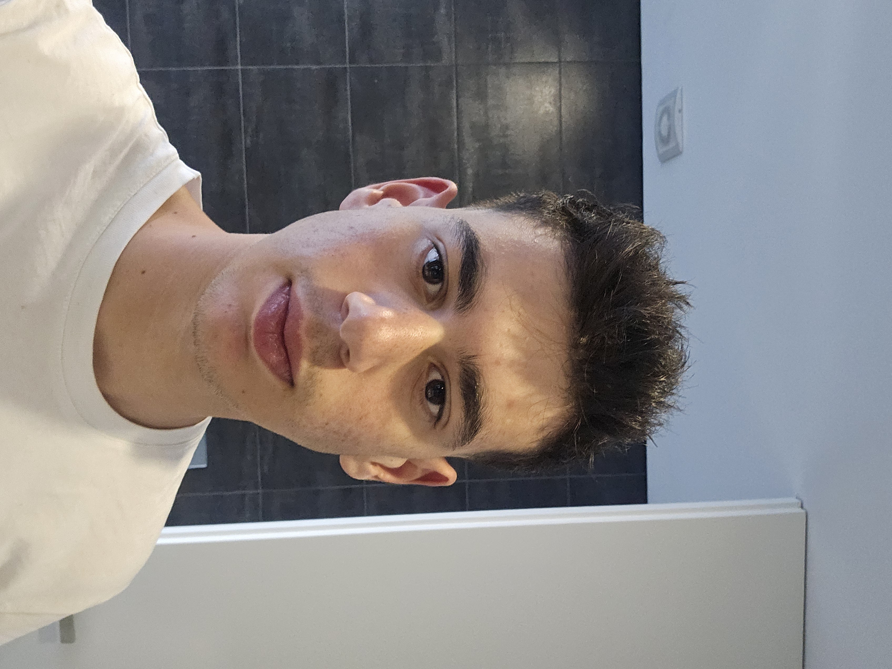

**Nome:** Dinis Martim Gomes Alves

**id:** A113629

**Resumo**: Desenvolver um jogo de adivinha em que o objetivo é o utilizador ou o computador adivinharem um número entre 0 e 100.

[Resolução](jogo_adivinha.py)
